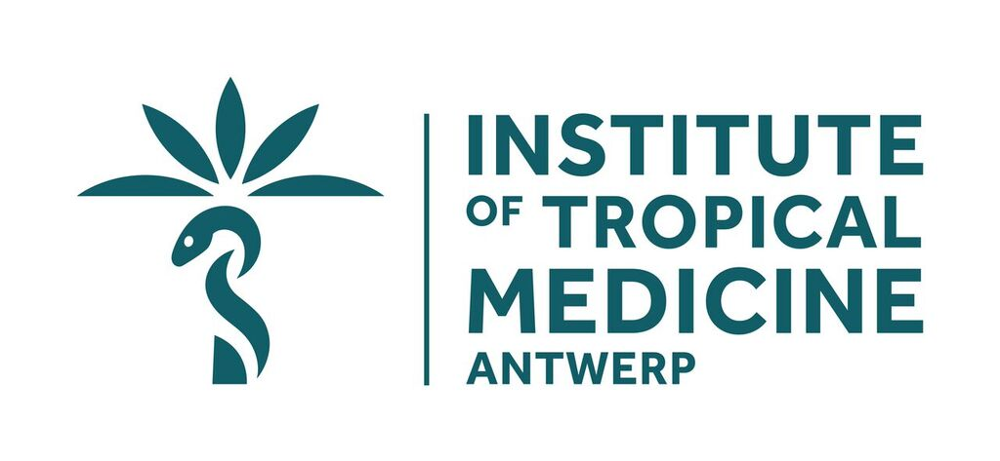
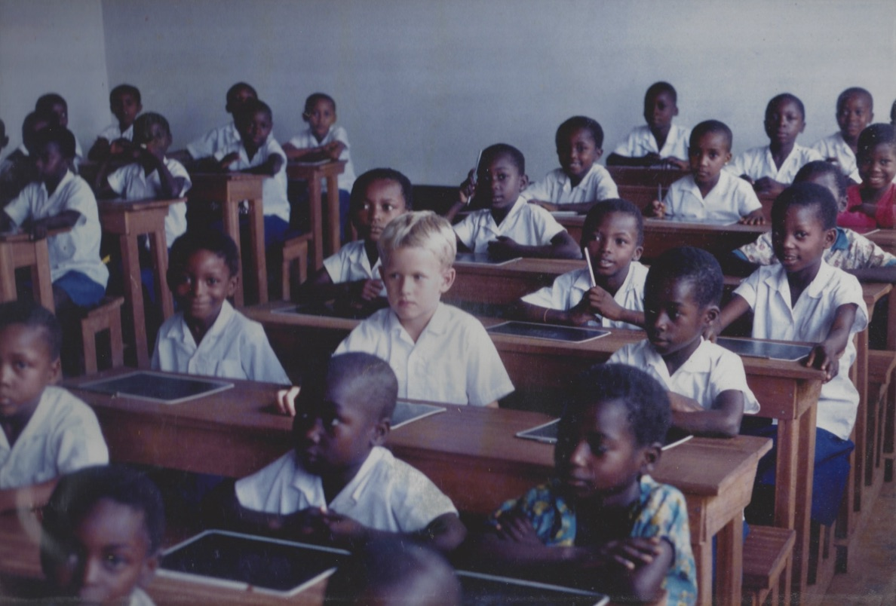

## Details
  
**Dr Frederik Van den Broeck**  
[Unit of Molecular Parasitology](https://pure.itg.be/en/organisations/moleculaire-parasitologie(f9b203f9-2c4d-48ac-90b8-85e4a8928272).html); [Unit of Veterinary Protozoology](https://pure.itg.be/en/organisations/veterinaire-protozooelogie(bc17ca80-35f8-4133-9560-2412fd194af4).html)  
Department of Biomedical Sciences, Institute of Tropical Medicine  
Nationalestraat 155, Antwerp, Belgium  

Tel.: +32(0)32470794  
Email: fvandenbroeck@itg.be  
Publons: [Reviewer and Editorial History](https://publons.com/author/1257460)  
  

## Research interests
I am a biologist specialized in **genetics/genomics** and working on **infectious diseases** found in the **tropics**. 

I am particularly interested in understanding how **pathogens** evolve in nature, addressing questions such as: how do parasites become drug-resistant? Which genes are involved? What is the role of parasite sex in spreading those genes in natural populations? Answering these questions with **genomic data** could provide new hope in controlling or even eliminating diseases. 

While HIV/AIDS, malaria and tuberculosis merit considerable scientific attention, it is important not to overlook those **tropical diseases** that plague the world’s developing countries. My research focuses on three such diseases that have devastating worldwide consequences for both human and animal health, namely **(Muco-)cutaneous leishmaniasis** or *espundia*, **Animal African Trypanosomiasis** or *nagana* and **Human Schistosomiasis**.

## Early childhood in Congo
The roots of my fascination with the tropics can be traced to my **early childhood in Africa**, where I spent six years in the northern equatorial rainforest of the Democratic Republic of Congo (DRC). My interest in tropical diseases was sparked by the 1995 Ebola outbreak in Kikwit (DRC) because of its mysterious appearance and because it occurred in a country where I spent several formative years. From that moment onwards I have always wanted to work on infectious diseases. This aspiration became more concrete during my Biology studies at the University of Leuven, where I became particularly interested in **bridging evolutionary genetics and disease control**.

  

