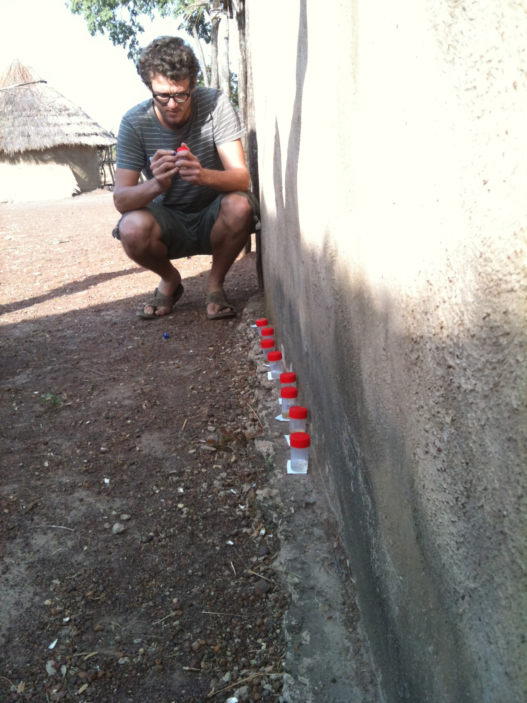

**Dr Frederik Van den Broeck**  
  

## Research interests

I am a biologist working on **infectious diseases** found in the **tropics**. 

My main research interest is the use of **next generation sequencing** to better understand the biology and evolution of eukaryotic parasites within a clinical and epidemiological context. I believe **genomic data** could help controlling or eliminating diseases as it provides the power to identify genes underlying drug resistance or virulence, and trace their spread in natural **pathogen** populations.

I'm particular interested in studying **neglected tropical diseases**, namely diseases that plague the wolrd's developing countries but still receive far too little scientific attention compared to diseases such as HIV/AIDS, malaria and tuberculosis. My research focuses on three such diseases that have devastating worldwide consequences for both human and animal health, namely **(Muco-)cutaneous leishmaniasis** or *espundia*, **African Trypanosomiasis** and **Human Schistosomiasis**.

## Media coverage
VRT NWS: [Belgische wetenschappers vinden link tussen klimaatverandering en nieuwe ziekteverwekkers](https://www.vrt.be/vrtnws/nl/2020/09/23/klimaatveradnering-nieuwe-ziekte-itg/)

EOS: [Zo ontstaat een nieuwe ziekte](https://www.eoswetenschap.eu/natuur-milieu/zo-ontstaat-een-nieuwe-ziekte)

Het laatste nieuws: [Na dertig jaar uitgeklaard: ook parasieten hebben seks](https://www.hln.be/wetenschap-planeet/wetenschap/na-dertig-jaar-uitgeklaard-ook-parasieten-hebben-seks~a662bcc5/)

De Standaard: [Schistosomiase-parasiet slaat toe in Noord-Senegal na bouw van twee dammen](https://www.standaard.be/cnt/dmf20150814_01818987)

De Morgen: [Parasiet slaat toe in Noord-Senegal na bouw van twee dammen](https://www.demorgen.be/nieuws/parasiet-slaat-toe-in-noord-senegal-na-bouw-van-twee-dammen~b7b24dce/)

Knack: [Parasieten profiteren van ons](https://bio.kuleuven.be/eeb/lbeg/docs/Knack-02-09-2015-Parasieten%20profiteren%20van%20ons.pdf)

KUL nieuws: [Congo-expeditie rond biodiversiteit](https://nieuws.kuleuven.be/nl/campuskrant/0910/08/congo-expeditie-rond-biodiversiteit)

Science Faculty News: [Boyekoli Ebale Congo 2010 (lingala voor ‘Studie van de Rivier’)](https://github.com/FreBio/FreBio.github.io/Boyekoli Ebale Congo 2010 (lingala voor ‘Studie van de Rivier’).pdf)

## Five main publications

**Van den Broeck F**, Savill N, Imamura H, Sanders M, Maes I, Cooper S, Mateus D, Jara M, Adaui V, Arevalo J, Llanos-Cuentas A, Garcia L, Cupolillo E, Miles M, Berriman M, Schnaufer A, Cotton J, Dujardin JC. [Ecological divergence and hybridization of Neotropical Leishmania parasites](https://www.pnas.org/content/early/2020/09/18/1920136117). PROCEEDINGS OF THE NATIONAL ACADAMY OF SCIENCES. 2020

Tihon E, Imamura H, Dujardin JC, Van Den Abbeele J & **Van den Broeck F**. [Discovery and genomic analyses of hybridization between divergent lineages of *Trypanosoma congolense*, causative agent of Animal African Trypanosomiasis](http://onlinelibrary.wiley.com/doi/10.1111/mec.14271/abstract). MOLECULAR ECOLOGY. 26 (23): 6524–6538. 2017

**Imamura H, Downing T, Van den Broeck F**, Sanders MJ, Rijal S, Sundar S, Mannaert A, Vanaerschot M, Berg M, De Muylder G, Dumetz F, Cuypers B, Maes I, Domagalska M, Decuypere S, Rai K, Uranw S, Bhattarai NR, Khanal B, Prajapati VK, Sharma S, Stark O, Schönian G7, De Koning HP, Settimo L, Vanhollebeke B, Roy S, Ostyn B, Boelaert M, Maes L, Berriman M, Dujardin JC & Cotton JA. [Evolutionary genomics of epidemic visceral leishmaniasis in the Indian subcontinent](https://doi.org/10.7554/eLife.12613). ELIFE. 5: e12613. 2016

**Van den Broeck F**, Maes G, Larmuseau M, Rollinson D, Sy I, Faye D, Volckaert F, Polman K & Huyse T. [Reconstructing colonization dynamics of the human parasite Schistosoma mansoni following anthropogenic environmental changes in Northwest Senegal](https://doi.org/10.1371/journal.pntd.0003998). PLOS NEGLECTED TROPICAL DISEASES. 9 (8): e0003998. 2015

**Van den Broeck F**, Meurs L, Raeymaekers JAM, Boon N, Tandakha N, Volckaert FAM, Polman K & Huyse T. [Inbreeding within human Schistosoma mansoni: do host-specific factors shape the genetic composition of parasite populations?](https://doi.org/10.1038/hdy.2014.13) HEREDITY. 113: 32-41. 2014
